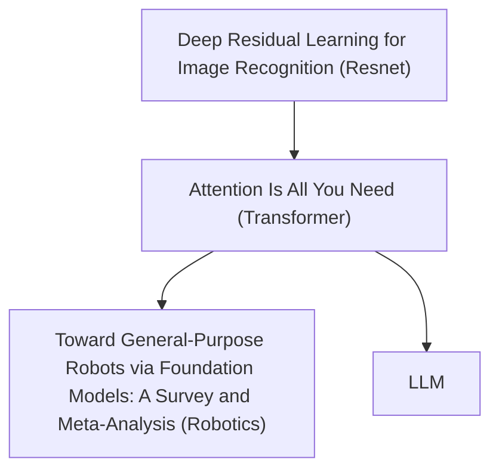

Creating my learning roadmap for AI and Robotics. 

_Deep Residual Learning for Image Recognition_ [[Paper]](/assets/source/materials/papers/resnet/Deep Residual Learning for Image Recognition.pdf)
 - resnet: visual recognition, imageNet detection
 - residual blocks, bottleneck architecture

_Attention Is All You Need_ [[Paper]](/assets/source/materials/papers/transformer/Attention Is All You Need.pdf)
 - transformer: translation, images, audio, video generation/processing
 - encoder, decoder, attention-based models

_Toward General-Purpose Robots via Foundation Models: A Survey and Meta-Analysis_ [[Paper]](/assets/source/materials/papers/robotics/survey/Toward General-Purpose Robots via Foundation Models A Survey and Meta-Analysis.pdf)

_AUTORT: EMBODIED FOUNDATION MODELS FOR LARGE SCALE ORCHESTRATION OF ROBOTIC AGENTS_ [[Paper]](/assets/source/materials/papers/robotics/reasoning/AutoRT.pdf)
 - Autonomous robotics research: enable independent and broadly capable robotic agents