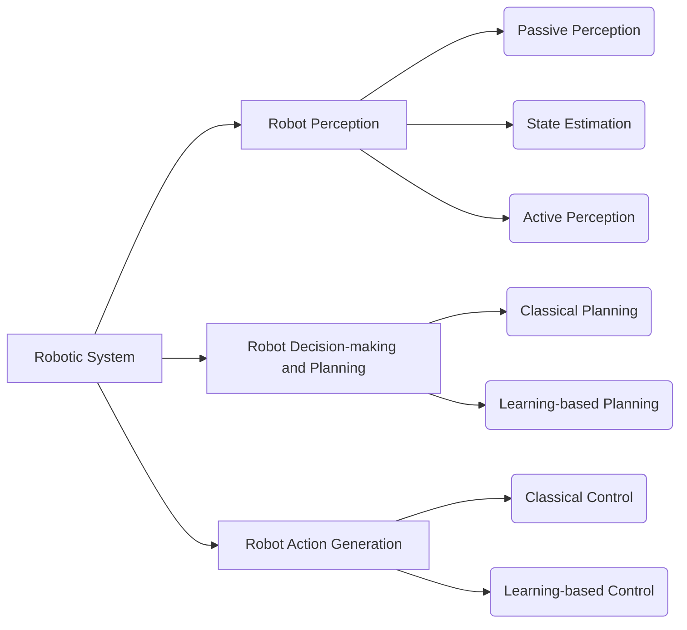
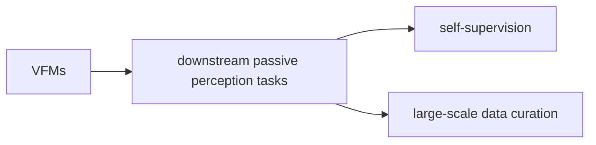
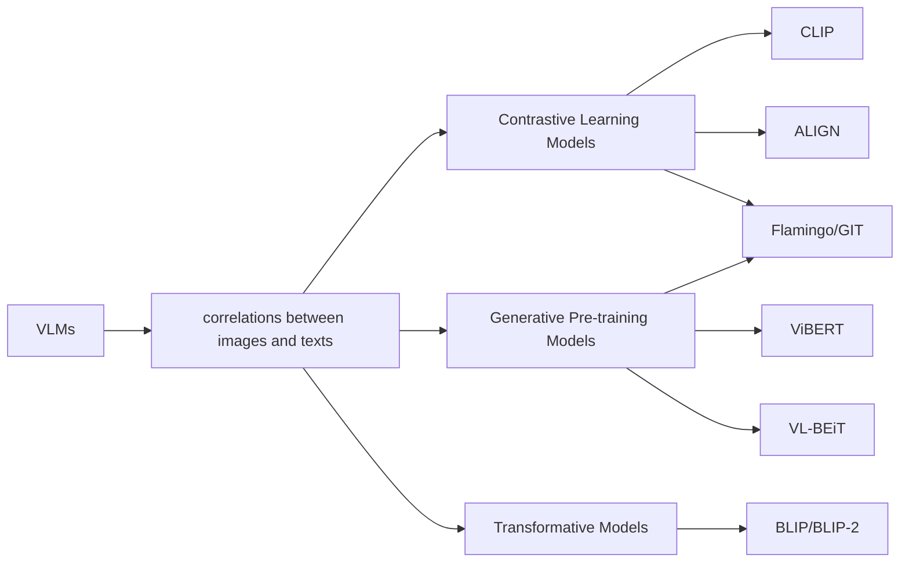
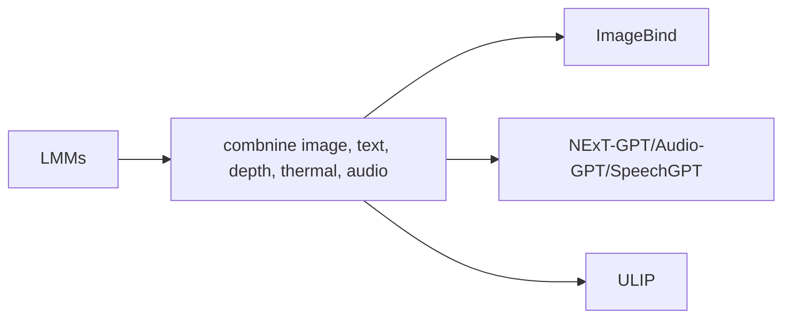

Summarising from _Toward General-Purpose Robots via Foundation Models: A Survey and Meta-Analysis_ [[Paper]](/assets/source/materials/papers/robotics/survey/Toward General-Purpose Robots via Foundation Models A Survey and Meta-Analysis.pdf)

## Robotic System Classification in General

## Visual Foundation Models (VFMs)

## Vision-Language Models (VLMs)

## Large Multimodal Models (LMMs)

