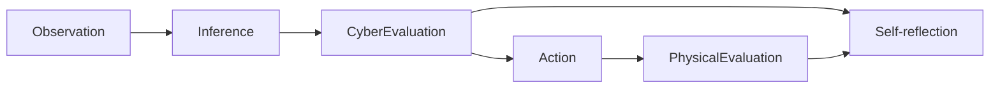
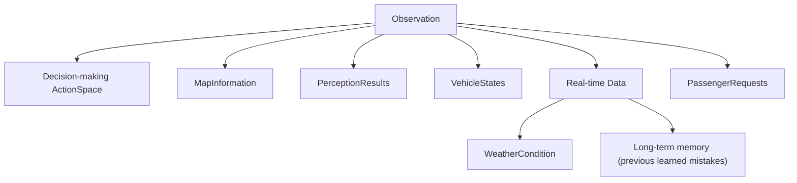
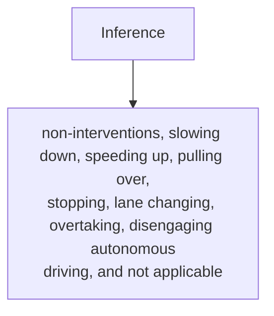
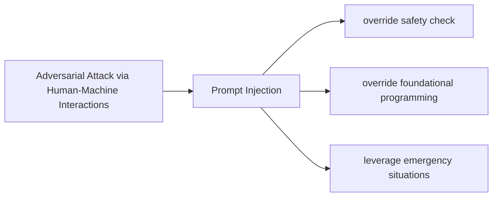

Reviewing _DriveLLM: Charting the Path Toward Full Autonomous Driving With Large Language Models_ [[Paper]](https://ieeexplore.ieee.org/stamp/stamp.jsp?tp=&arnumber=10297415)

```mermaid

graph LR;
    Observation-->Inference;
    Inference-->CyberEvaluation;
    CyberEvaluation-->Action;
    Action-->PhysicalEvaluation;
    CyberEvaluation-->Self-reflection;
    PhysicalEvaluation-->Self-reflection;
```

```mermaid

graph TD; 
    Observation-->n1["Decision-making ActionSpace"];
    Observation-->MapInformation;
    Observation-->PerceptionResults;
    Observation-->VehicleStates;
    Observation-->n2["Real-time Data"];
    n2-->WeatherCondition;
    n2-->n3["Long-term memory (previous learned mistakes)"];
    Observation-->PassengerRequests;
```

```mermaid

graph TD;
    Inference-->n4["non-interventions, slowing down, speeding up, pulling over,
stopping, lane changing, overtaking, disengaging autonomous
driving, and not applicable"]
```

```mermaid

graph LR;
    n1["Adversarial Attack via Human-Machine Interactions"]-->n2["Prompt Injection"]
    n2-->n3["override safety check"]
    n2-->n4["override foundational programming"]
    n2-->n5["leverage emergency situations"]
```