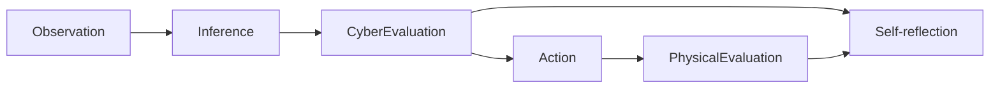
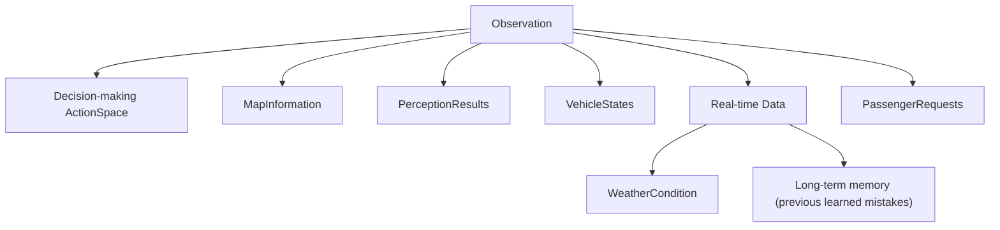
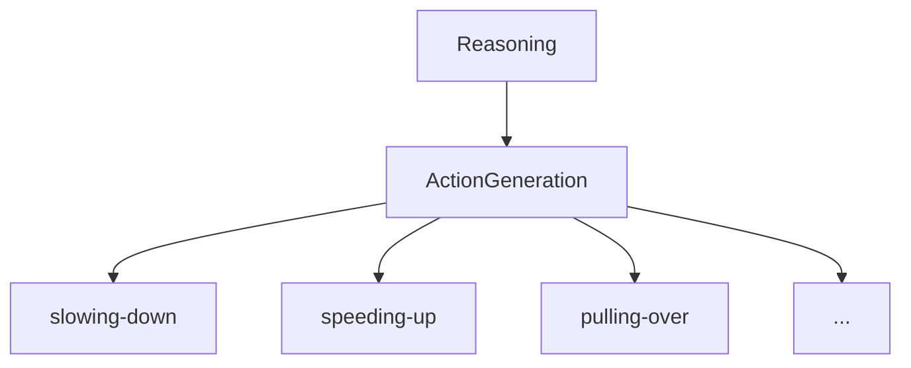
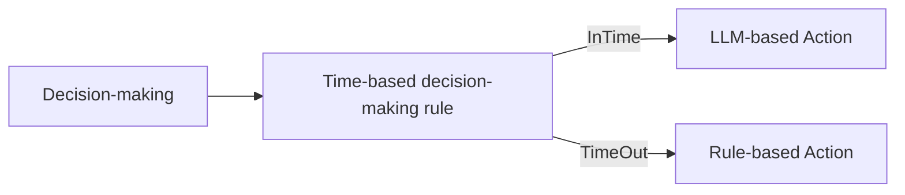
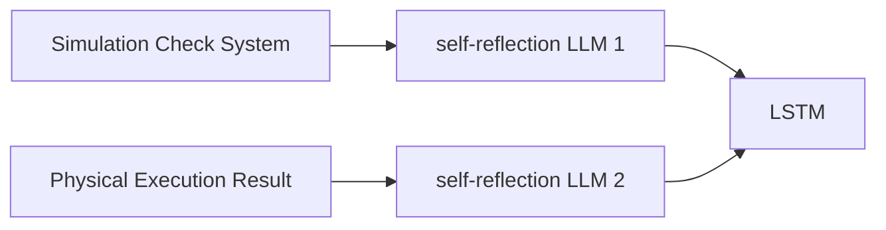
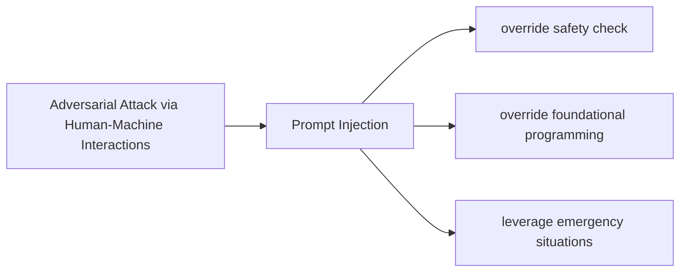

Reviewing _DriveLLM: Charting the Path Toward Full Autonomous Driving With Large Language Models_ [[Paper]](https://ieeexplore.ieee.org/stamp/stamp.jsp?tp=&arnumber=10297415)

## General Workflow

## Observation

## Reasoning

## Decision-making

## Self-reflection

## Attack Scenario

