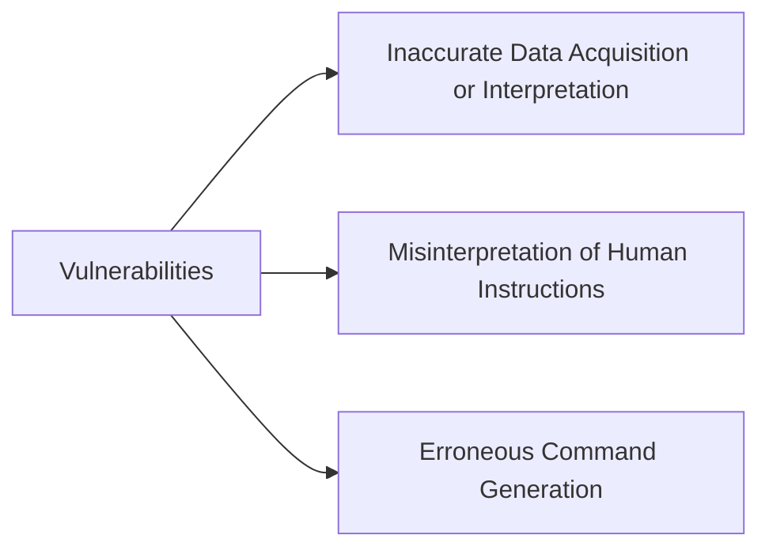
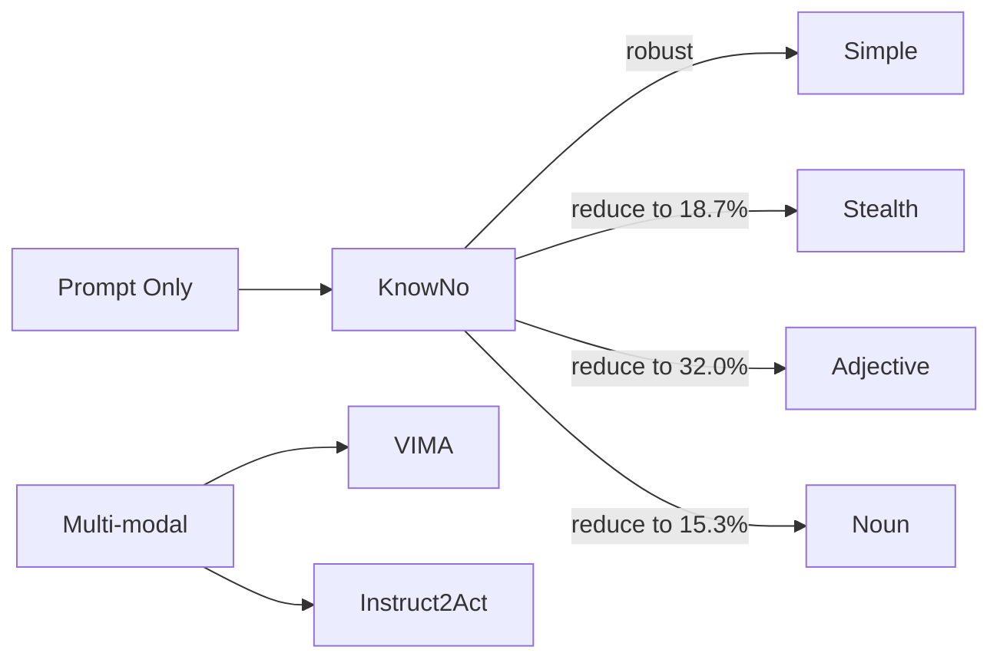

Reviewing _On the Safety Concerns of Deploying LLMs/VLMs in Robotics: Highlighting the Risks and Vulnerabilities_ [
[Paper]](https://arxiv.org/pdf/2402.10340.pdf)

LLM security issues

 - hallucination, illusion 
 - ambiguity of contextual information provided by text or images 
 - template-based prompt format - lack of flexibility - misunderstanding of prompts
 - multi-modality in prompt input - higher failure risk

## Basic architecture

## Vulnerabilities and Attacks

## Evaluation

