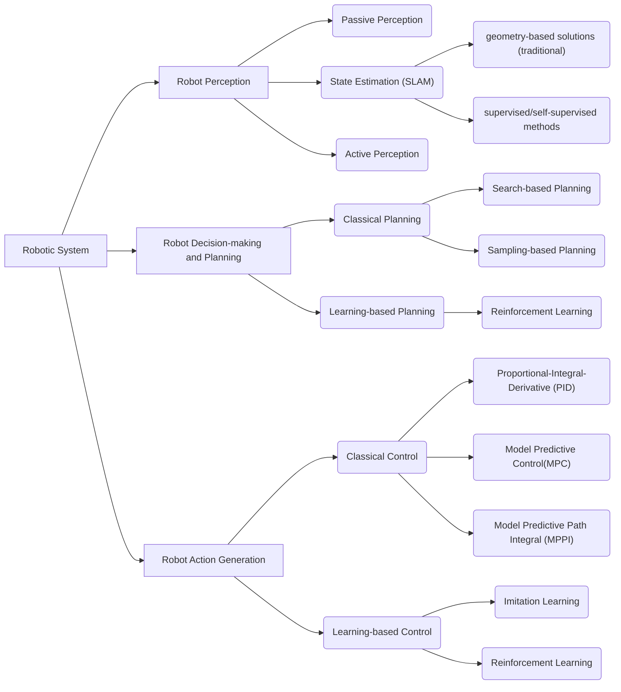
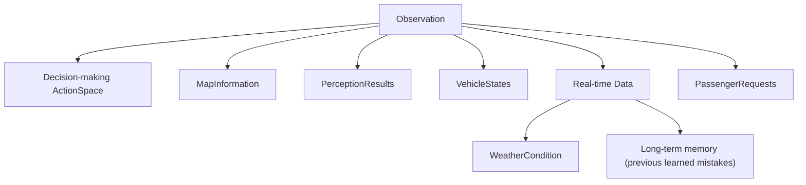
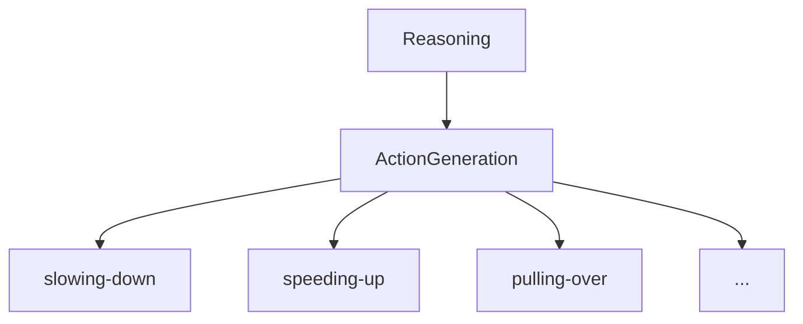
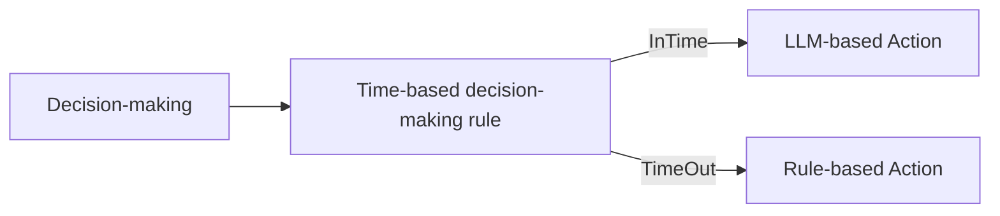
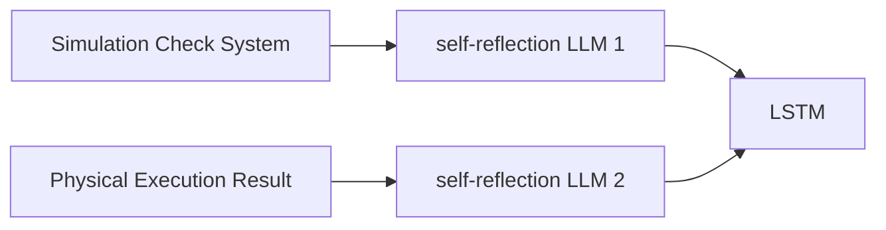
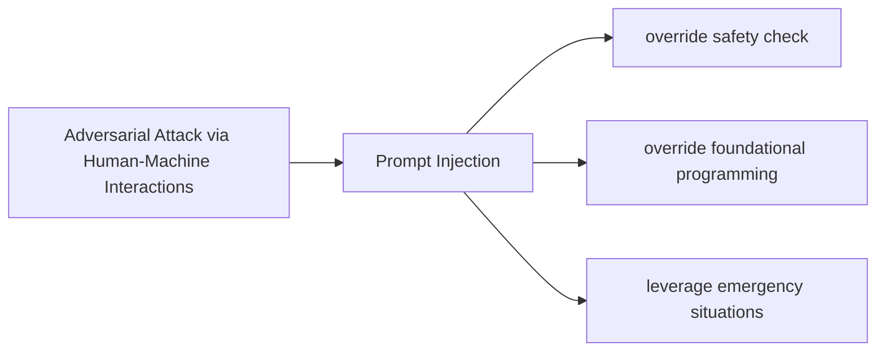

## Survey

_Toward General-Purpose Robots via Foundation Models: A Survey and Meta-Analysis_ [[Paper]](https://arxiv.org/pdf/2312.08782.pdf)

_A Survey on Multimodal Large Language Models for Autonomous Driving_
[[Paper]](https://arxiv.org/abs/2311.12320)

## DriveLLM

_DriveLLM: Charting the Path Toward Full Autonomous Driving With Large Language Models_ [[Paper]](https://ieeexplore.ieee.org/stamp/stamp.jsp?tp=&arnumber=10297415)

### Observation

### Reasoning

### Decision-making

### Self-reflection

### Attack Scenario

### Evaluation

Real-time Performance:
- decision-making time
    - Token-per-minute (TPM)
    - Decision-per-second (DPS)

Spatial-Temporal Reasoning in Dynamic Environments:
- existing LLMs process inputs independently without temporal aspects
    - less effective when interacting with multiple dynamic objects (conservative)
    - Mitigation:
        - Responsibility-Sensitive Safety (RSS) model
            - convert temporal object information (position, velocity...) into textual data

Proactive Decision-making:
- model can anticipate potential challenges and react accordingly
    - integrating observations with commonsense reasoning

## Safety

_On the Safety Concerns of Deploying LLMs/VLMs in Robotics: Highlighting the Risks and Vulnerabilities_ [
[Paper]](https://arxiv.org/pdf/2402.10340.pdf)

_How Secure Are Large Language Models (LLMs) for Navigation in Urban Environments?_ [[Paper]](https://arxiv.org/pdf/2402.09546.pdf)

_Semantic anomaly detection with large language models_
[[Paper]](https://link.springer.com/content/pdf/10.1007/s10514-023-10132-6.pdf)

