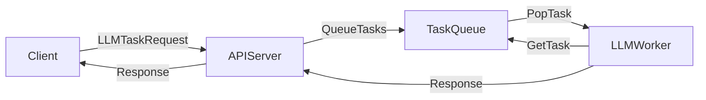

## Project Progress

### LLMs
- Setting up LLM environment locally (llama2-7b-chat).
- Working with Pascal to develop self-hosted LLMs (developing API).
- [[WA Data & LLM Platform]](https://llm.nlp-tlp.org/)
- [[LLM API]](https://api.nlp-tlp.org/redoc/#tag/queue_task)
- [[Bring LLM to WA Community]](https://uwa-nlp-tlp.gitbook.io/llm-tutorial)

### Simulator
- Setting up basic environment for the project.
  - Dockerizing the simulator.
  - prepare for integrations.

## TODOs
- [[Paper]](https://www.overleaf.com/project/660fbf6b9ea6dbdd103450d1).
  - Working with Xiangrui.
  - [[ITSC]](https://its.papercept.net/conferences/scripts/start.pl) if possible (due 1st May), Suggestions?
  - Ideas? Is latency a good topic? 
    - Metrics?
      - LLM computing time, vehicle responding time, end-to-end responding time
    - what about other ideas? Accuracy?

- Research Proposal:
  - Improve the overall performance of LLM in the context of navigating robotics.
    - Issues:
      - Accuracy: 
        - Multi-modal LLMs vs text only LLMs.
        - Common way in LLMs: Prompting, RAG, and Fine-tuning.
      - Latency:
        - On-premise open-source LLMs vs Cloud-based LLMs.
        - Scaling LLM size (light-LLM)
    - Method:
      - Eyesim, Carla, ShuttleBus, Indoor robot?
      - LLM optimisations:
        - Prompting: Chain of thoughts, Visual QA
        - *RAG: relational, knowledge graph, vectorstore, attention.
        - Fine-tuning?

## Additional
- Add name?
- Kaya account for using GPUs.
- 
