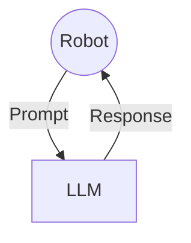
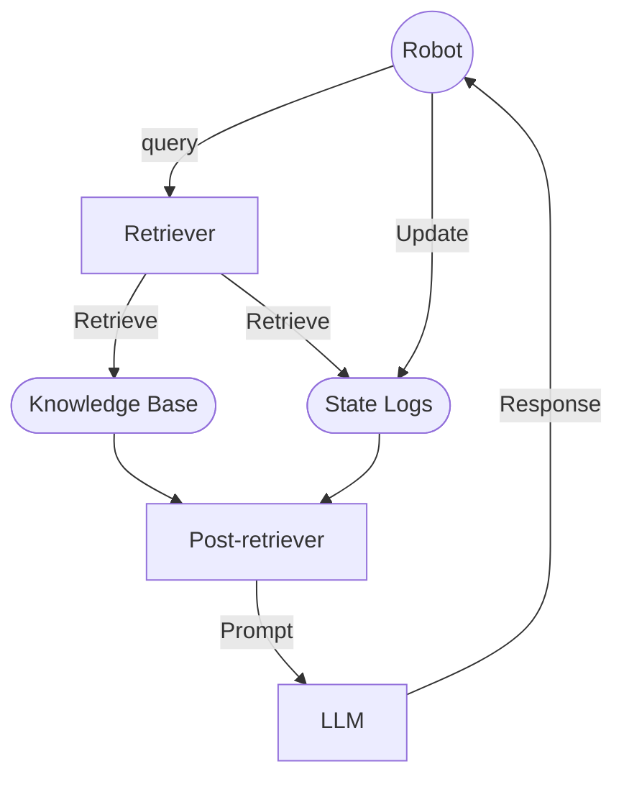
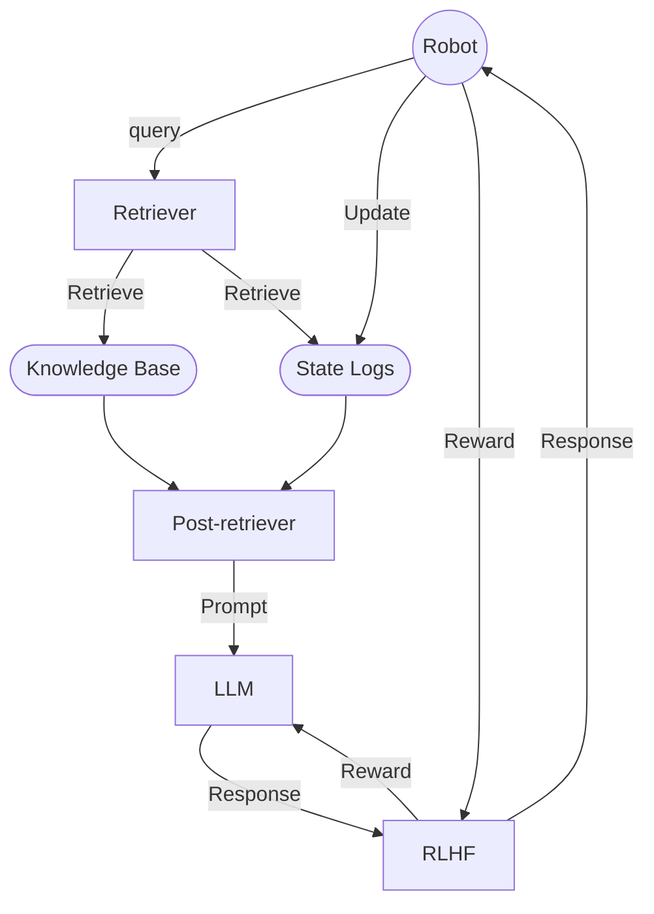

 - Reviewed existing RAG methods
   - embedding model
 - Reviewed existing RLHF methods
   - rewarding model
 - Reviewed existing finetuning methods
   - prompt/instruction tuning
   - parameter tuning

## RAG

 - Frozen LLM, focus on RAG and RLHF 
 - RAG: assist LLM to generate in-context responses
   - main questions:
     - how and what to retrieve: 
       - similarity for unstructured
       - sql for relational
       - cypher for graph
     - when to retrieve:
       - retrieve after scope is obtained
       - let LLM decide
   - other questions:
     - how to preprocess
       - system prompt: setup roles, tasks, workflow, restrictions
     - how to prompt
     - how to pass context
     - how to post-process
       - json, reference list, etc.
     - how to verify
       - accuracy, relevance to the knowledge base
 - RLHF: Mitigate hallucinations

## RLHF

### RL guiding LLM

LLM is the agent to control robot
 - prompt tuning
 - parameter tuning

### LLM guiding RL

RL is the agent to control robot
 - convert human feedback to reward policy
 - automatically generate reward policy based on tasks/scenarios

## Framework Brainstorming

### Robot + LLM

### Robot + LLM + Retriever

### Robot + LLM + Retriever + RLHF

## Use cases brainstorming
 - Eyesim
   - [Assignments](https://roblab.org/courses/mobrob/labs/)
   - [API](https://roblab.org/eyebot/robios.html)
   - State Logs: Data collected during the simulation
 - Vehicle
   - Document:
   - State Logs:
 - Arm
   - Document:
   - State Logs:
 - Humanoid
   - Document:
   - State Logs:
