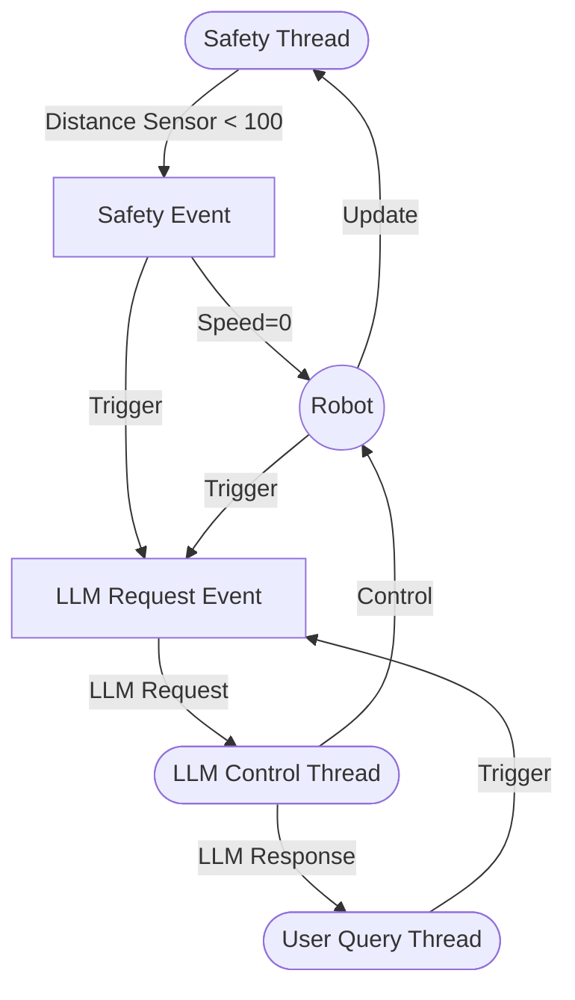

## Literature reviews

[Overleaf](https://www.overleaf.com/project/660fbf6b9ea6dbdd103450d1)

## Asynchronous LLM Request / Control
 - thread 1 running rule-based safety checks
 - thread 2 running LLM control
 - thread 3 running user query

## Lawnmower, Maze

hard coded script vs zero-shot LLM vs LLM + RAG

## Issues

 - Prompt, retrieve content
 - LLM response parsing
   - response content
   - response format
 - User query

