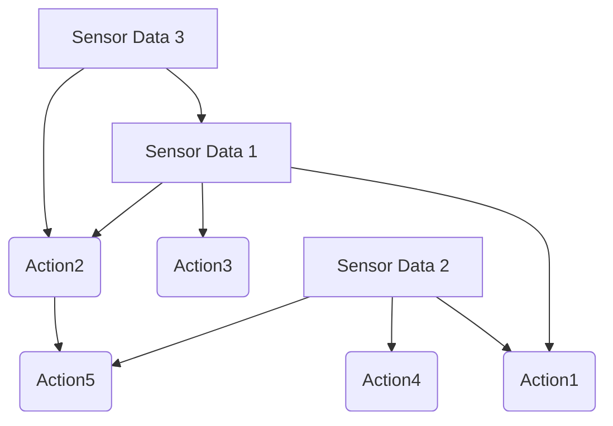

## Asynchronous LLM Request / Control
 - thread 1 running rule-based safety checks
 - thread 2 running LLM control
 - thread 3 running user query

## Data for Retrieval

 - scene graph

 - sensor-action graph (May grab data from hard coded script)
   - giving a set of sensor data, find k most similar sensor nodes.
     - may start with one sensor with a few range of values
       - e.g.: distance sensor, range [0, 1000], 0-200, 200-400, 400-600, 600-800, 800-1000, >1000
   - query these sensor nodes, list all connected action nodes with priorities, send to LLM

 - trace logs

 - map

## Lawnmower / Maze

hard coded script vs zero-shot LLM vs LLM + RAG

## Issues

 - Task scenarios brainstorming (May start with finding objects in the environment)
   - ~~have all the information of the environment (may not be so interesting)~~
     - ~~e.g.: the can is at (x,y), go and find it~~
     - ~~retrieve map, scene graph, sensor-action graph, trace logs.~~
   - have limited information of the environment
     - e.g.: there is a can behind the wall, try to find it
     - retrieve scene graph, sensor-action graph, trace logs.
   - no information of the environment
     - e.g.: try to find a can somewhere in the world
     - retrieve sensor-action graph, trace logs.
   - have incorrect information of the environment
     - e.g.: the can is at (x,y), but it is not there
     - retrieve map, scene graph, sensor-action graph, trace logs.
   - dynamic environment
     - e.g.: the can is moving, go and find it
 - ~~Prompt, retrieve content~~
 - LLM response parsing
   - response content
   - response format
 - User query

