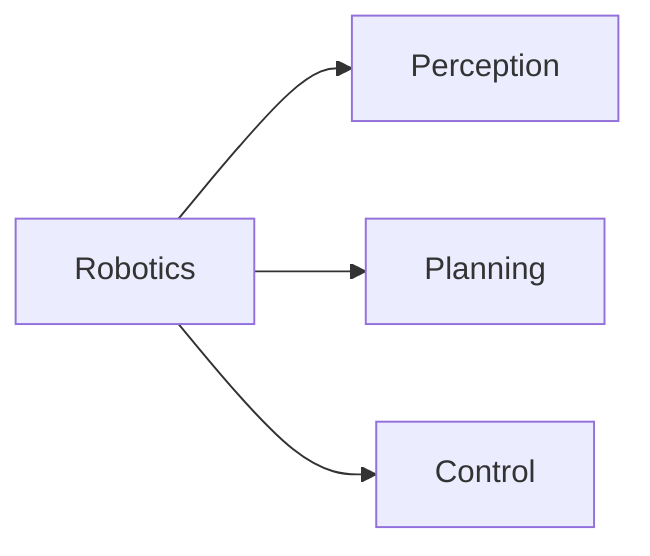
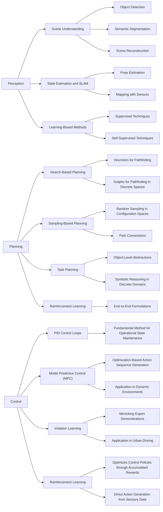

#  Leveraging Large Language Models for General-Purpose Robot Control

## Introduction

**Key Points:**
- **Significance of AI in Robotics:**
    - AI and machine learning advancements drive the rise of general-purpose robots.
    - Enables robots to perform diverse tasks with increased efficiency and adaptability.

**Examples of AI-Powered Robots:**
1. **Autonomous Vehicles**:
    - **Example**: Tesla's self-driving cars
    - **Application**: Navigate roads, avoid obstacles, and respond to traffic signals autonomously.
    - **Reference**: [Tesla Autopilot](https://www.tesla.com/autopilot)
      
2. **Service Robots in Hospitality**:
    - **Example**: SoftBank Robotics' Pepper
    - **Application**: Used in hotels and restaurants to greet guests, provide information, take orders, and even entertain.
    - **Reference**: [Pepper Robot](https://emea.softbankrobotics.com/)
      
3. **Security Robots**:
    - **Example**: Knightscope K5
    - **Application**: Patrol areas such as parking lots, corporate campuses, and malls to detect anomalies, provide surveillance, and deter crime.
    - **Reference**: [Knightscope K5](https://www.knightscope.com/)
      

## Motivation

**Challenges with AI in Robotics for Traditional Approaches:**
- The models are typically trained on specific datasets to perform specific tasks.
  - Having difficulty in generalizing across diverse tasks.
  - Unpredictability of real-world environments because of the edge conditions.

**Proposed Research Topics**
 - **Leveraging Large Language Models (LLMs)**:
   - **Pre-trained Foundation models**: 
     - large-scale models that are trained on extensive and diverse datasets to acquire a broad knowledge base.
     - Knowledge-rich and capable of reasoning across diverse tasks.
   - **Interpretation of Natural Language Instructions**: 
     - Enhances human-robot interaction.
   - **Multi-Modal Sensory Data Interpretation**: 
     - Improves task planning and action generation.

**Research Questions**
 - How can LLMs be effectively integrated into general-purpose robotic systems to improve the 
 interpretation of natural language instructions and multi-modal sensory data for enhanced task planning and action 
   generation?
 - What are the optimal strategies that allows LLMs to access and utilize domain-specific knowledge in real-time to mitigate risks of inaccurate or false information and improve the performance and adaptability of general-purpose robots?

## Background

### Perception

### Planning

### Control

## Related Works

### Before LLM Emergence

### LLM-powered Robotics

 - Perception
   - receive sensory data and interpret it in natural language.
 - Planning
   - generate task plans based on natural language instructions and sensory data of the robot
 - Control
   - generate actions based on the task plans and sensory data.
   - explain the actions taken in natural language.

## Current Work

LLM for Robotics Navigations using Eyesim simulator

<video width="640" height="360" controls>
  <source src="{{page.imgUrl}}eyesimllm.mp4" type="video/mp4">
  Your browser does not support the video tag.
</video>

