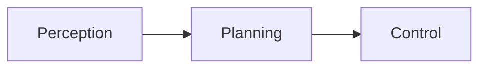
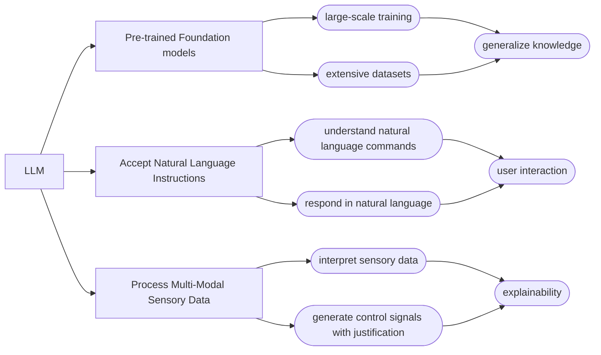
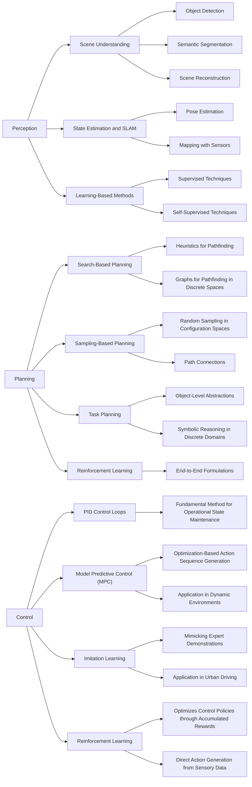

#  Integrating Large Language Models for General-Purpose Robots

## Introduction

**Significance of AI in Robotics:**
 - AI advancements drive the rise of general-purpose robots as it enables robots to perform diverse tasks with 
   increased efficiency and adaptability.

**Examples of AI-Powered Robots:**
1. **Autonomous Vehicles**:
    - **Example**: Tesla's self-driving cars
    - **Application**: Navigate roads, avoid obstacles, and respond to traffic signals autonomously.
    - **AI Techniques**: Deep Learning
    - **Reference**: [Tesla Autopilot](https://www.tesla.com/autopilot)
      
2. **Service Robots in Hospitality**:
    - **Example**: SoftBank Robotics' Pepper
    - **Application**: Used in hotels and restaurants to greet guests, provide information, take orders, and even entertain.
    - **AI Techniques**: Speech Recognition, Emotion Detection
    - **Reference**: [Pepper Robot](https://emea.softbankrobotics.com/)
      
3. **Security Robots**:
    - **Example**: Knightscope K5
    - **Application**: Patrol areas such as parking lots, corporate campuses, and malls to detect anomalies, provide surveillance, and deter crime.
    - **AI Techniques**: Anomaly Detection
    - **Reference**: [Knightscope K5](https://www.knightscope.com/)
      

## Background

3 phases in autonomous robotic systems:

### Perception

### Planning

### Control

## Motivation

**Challenges with Traditional AI in Robotic systems:**
 - Rule-based approach, optimisation algorithms, deep learning models
   - hard to deal with unpredictable, real-world environments. 
   - hard to effectively generalize real-world tasks.

**Leveraging Large Language Models: GPT, LLAMA, Gemini...**

**Research Questions**
 - integrating LLM Robot - perception, planning, control:
   - How can LLMs be effectively integrated into general-purpose robotic systems to improve the interpretation of natural language instructions and multi-modal sensory data for enhanced task planning and action generation?
 - improving LLM performance - response generation with domain specific knowledge:
   - What are the optimal strategies that allows LLMs to access and utilize domain-specific knowledge in real-time to improve the performance and adaptability of general-purpose robots?
 - mitigating LLM hallucinations - error handling / mitigation:
   - How can we minimise the risks of inaccurate or false information generated by LLMs, such as mismatches between robots' actions and LLM-generated explanations, to enhance transparency and trust in human-robot interactions?

## Related Works

### Before LLM Emergence

### LLM-powered Robotics

 - Perception
   - receive sensory data and interpret it in natural language.
 - Planning
   - generate task plans based on 
     - natural language instructions and 
     - perception result.
 - Control
   - generate actions based on the planning result.
   - explain the actions taken in natural language.
     - reference for the next action generation.

## Current Work

LLM for mobile robot navigations using Eyesim

<video width="640" height="360" controls>
  <source src="{{page.imgUrl}}eyesimllm.mp4" type="video/mp4">
  Your browser does not support the video tag.
</video>

